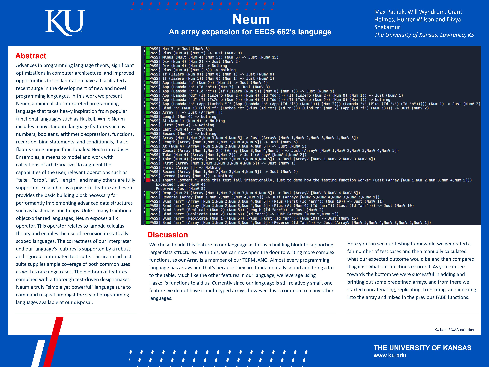
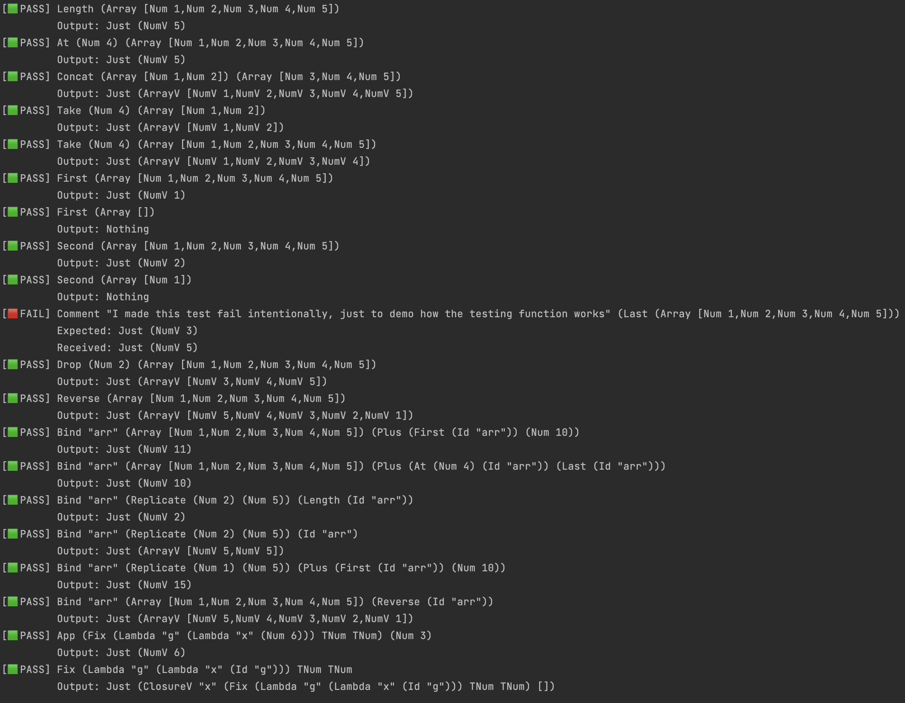

# Neum

An EECS 662 Final Project

An interpreted functional programming language written in Haskell with
type checking and array support.

More details are included in the poster we presented at the
undergraduate research center:

## Testing

The code includes a tiny testing framework that runs our evaluation
for different inputs, and compares expected output to the actual output,
and outputs the difference on mismatch:

